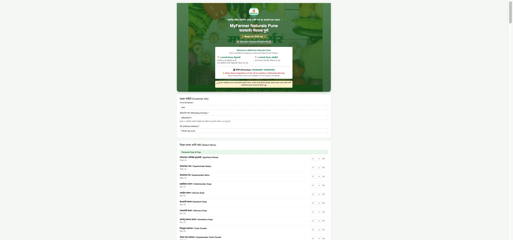
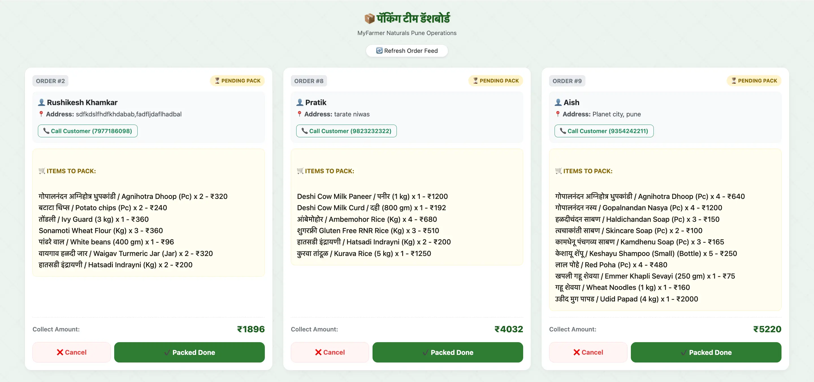

# Agri-order-monolith
A production-grade, zero-infrastructure e-commerce ordering engine and real-time operations dashboard designed specifically for local organic farms and green-grocers. Built entirely using Google Apps Script, Bootstrap 5, and Google Sheets as a reactive, serverless real-time database.

---

## 🚀 Core Architectural Features

* **Dynamic Inventory Aggregation:** Automatically splits customer baskets, normalizes weight conversions (e.g., automatically converting dynamic gram orders like `250gm` or `500gm` to fractional `kg` metrics), and updates a live master summary tab (`ItemSalesSummary`).
* **Operational Packaging Dashboard:** A dedicated worker view (`?view=worker`) providing real-time feed synchronization for order tracking, full-fillment marking, and customer speed-dialing utilities.
* **Reverse-State Financial Accounting:** Includes a dynamic item deduction algorithm. If a worker cancels a pending order from their interface, the system parses the structured line text strings in reverse, instantly recalculating and deducting quantities and accurate revenue figures from the financial analytics sheet.
* **Data Consistency Guardrails:** Implements native transaction safety checks, defensive error handlers, and strict regex-driven locale validation (e.g., validating 10-digit Indian mobile specifications).

---

## 🛠️ Tech Stack & Architecture

* **Runtime Environment:** Google Apps Script (V8 Engine)
* **Database & Analytics Engine:** Google Sheets API
* **Front-End Client Layer:** HTML5, CSS3 (Custom Glassmorphism Overlays), Bootstrap 5, JavaScript (Asynchronous Google Apps Script Client API Client-to-Server callbacks)

---

## 📸 User Interface & Dashboard Previews

### 🛒 Customer Order Journey (Multi-Step Web App)

  <h4>Step 1: Customer Details & Smart Catalog Selection</h4>
  
Features dynamic inventory grouping by category and input masking for telephone validation.

  
  
    
  
  <h4>Step 2: Real-Time Order Verification & Price Review</h4>
  
Shows live itemized pricing tallies, unit conversions, and calculated grand totals before submission.

  
  
    
  
  <h4>Step 3: Secure Order Success Confirmation</h4>
  
Instant client feedback window upon successful, asynchronous database insertion.

  

---

### 📦 Operational Fulfillment Interface

  <h4>Packaging Team Dashboard (`?view=worker`)</h4>
  
Live feed panel tracking pending lists with integrated click-to-call links and automated financial rollback mechanics.

  

---
